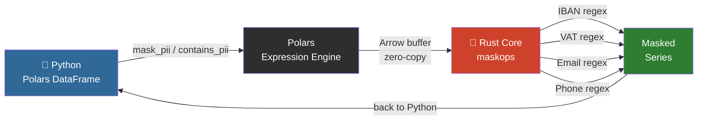

# maskops

> High-speed PII masking as a native Polars plugin — powered by Rust.

**maskops** extends Polars with zero-overhead PII detection and masking expressions.
No NLP models. No intermediate files. Just regex + Rust running directly on Arrow buffers.

## How It Works



No Python objects created per row. No NLP model loaded. No intermediate files.

- **Presidio** is heavy — it spins up NLP models for structured CSV data that doesn't need them.
- **Pure Python regex** on large DataFrames is slow.
- **maskops** compiles to a native `.so` that Polars calls directly — same speed as built-in expressions.

## Architecture

```
maskops/
├── Cargo.toml               # Rust dependencies (pyo3 0.21, pyo3-polars 0.18, polars 0.46)
├── pyproject.toml           # maturin build backend + PyPI metadata
├── src/
│   ├── lib.rs               # Polars expression registration (mask_pii, contains_pii)
│   └── patterns/
│       ├── mod.rs           # mask_all() and contains_any_pii() aggregators
│       ├── iban.rs          # IBAN regex + masking
│       ├── vat.rs           # EU VAT regex + masking
│       ├── email.rs         # Email regex + masking (local part)
│       ├── phone.rs         # E.164 phone regex + masking
│       └── country_codes.rs # Country prefix lookup table
├── maskops/
│   └── __init__.py          # Python API via register_plugin_function
└── tests/
    ├── test_masking.py      # pytest suite
    ├── generate_fixtures.py # Faker-based EU test data generator
    └── fixtures/            # Generated CSVs (gitignored)
```

The Rust layer operates directly on Arrow buffers — zero Python object overhead per row.
Each PII type is its own module: adding a new pattern = new file + one line in `mod.rs`.

## Install

```bash
pip install maskops
```

## Usage

```python
import polars as pl
import maskops

df = pl.read_csv("payments.csv")

# Mask all PII in a column
df.with_columns(maskops.mask_pii("notes"))

# Filter rows that contain PII
df.filter(maskops.contains_pii("free_text"))
```

## Supported patterns (v0.1.1)

| Pattern | Example input | Masked output |
|---------|--------------|---------------|
| IBAN    | `DE89370400440532013000` | `DE89******************` |
| EU VAT  | `DE123456789` | `DE*********` |
| Email   | `john.doe@example.com` | `********@example.com` |
| Phone   | `+14155552671` | `+1**********` |

Tested against 8 EU locales: DE, FR, ES, IT, NL, PL, PT, SE.
Email and phone follow RFC 5322 and E.164 respectively.

## Roadmap

- [x] Email, phone patterns
- [ ] IP address patterns
- [ ] Format-Preserving Encryption (FPE/FF3-1) for reversible masking
- [ ] Latin American IDs (RUT, CPF, CURP)
- [ ] Benchmark vs Presidio
- [ ] Parquet streaming support
- [ ] PyPI publish via GitHub Actions

## Build from source

### Windows (PowerShell)

```powershell
python -m venv .venv
.venv\Scripts\activate
pip install maturin faker polars pytest
maturin develop --release
python tests/generate_fixtures.py
pytest tests/ -v
```

### Linux / macOS

```bash
python -m venv .venv
source .venv/bin/activate
pip install maturin faker polars pytest
maturin develop --release
python tests/generate_fixtures.py
pytest tests/ -v
```

## Key dependency versions

| Package | Version |
|---------|---------|
| pyo3 | 0.21 |
| pyo3-polars | 0.18 |
| polars | 0.46 |
| maturin | >=1.7,<2.0 |

> **Note:** pyo3 must be 0.21 to match pyo3-polars 0.18. Do not bump pyo3 independently.

## License

MIT

## Benchmarks

Tested on 1,000,000 rows, Intel i-series CPU, Python 3.14, Windows.

### maskops throughput (v0.1.1 — IBAN, VAT, Email, Phone)

| Profile | Expression | Time | Rows/s | MB/s |
|---------|-----------|------|--------|------|
| clean (no PII) | `mask_pii` | 0.625s | 1,600,939 | 35.2 |
| clean (no PII) | `contains_pii` | 0.203s | 4,938,072 | 108.6 |
| dense (all PII) | `mask_pii` | 1.871s | 534,502 | 11.8 |
| dense (all PII) | `contains_pii` | 0.059s | 16,831,928 | 370.3 |
| mixed (50/50) | `mask_pii` | 1.000s | 1,000,235 | 22.0 |
| mixed (50/50) | `contains_pii` | 0.137s | 7,276,172 | 160.1 |

### vs pure Python regex (same machine)

| Profile | maskops `mask_pii` | Python `re` | Speedup |
|---------|-------------------|-------------|---------|
| clean | 0.625s | 0.918s | **1.5×** |
| dense | 1.871s | 1.543s | **0.8×** |
| mixed | 1.000s | 1.268s | **1.3×** |

> v0.1.1 adds email and phone patterns, so `mask_pii` now runs 4 pattern checks per row instead of 2. Clean and mixed data remain faster than pure Python. On dense data (every row contains PII matched by multiple patterns) the extra pattern overhead puts maskops slightly behind — this is expected and will improve with short-circuit optimisation in a future release. `contains_pii` is unaffected as it exits on first match.

### vs Microsoft Presidio (estimated)

Presidio processes structured DataFrames via `presidio-structured`, which runs a spaCy NLP pipeline per row. Based on community reports and the architecture:

| Tool | Throughput (structured data) | Requires NLP model |
|------|------------------------------|-------------------|
| maskops | ~500K–17M rows/s | No |
| Presidio (regex-only recognizers) | ~10–50K rows/s* | No |
| Presidio (spaCy NER) | ~1–5K rows/s* | Yes (250MB+) |

\* Estimated from community benchmarks and Presidio's own documentation noting it is "not optimized for bulk structured data." [Microsoft confirmed no official throughput benchmarks exist.](https://github.com/microsoft/presidio/discussions/1226)

**maskops is purpose-built for structured data pipelines where Presidio's NLP overhead is unnecessary.**