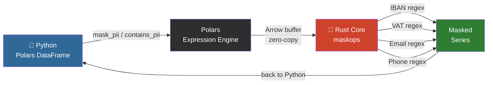

# maskops

> High-speed PII masking as a native Polars plugin — powered by Rust.

**maskops** extends Polars with zero-overhead PII detection and masking expressions.
No NLP models. No intermediate files. Just regex + Rust running directly on Arrow buffers.

## How It Works



No Python objects created per row. No NLP model loaded. No intermediate files.

- **Presidio** is heavy — it spins up NLP models for structured CSV data that doesn't need them.
- **Pure Python regex** on large DataFrames is slow.
- **maskops** compiles to a native `.so` that Polars calls directly — same speed as built-in expressions.

## Architecture

```
maskops/
├── Cargo.toml               # Rust dependencies (pyo3 0.21, pyo3-polars 0.18, polars 0.46)
├── pyproject.toml           # maturin build backend + PyPI metadata
├── src/
│   ├── lib.rs               # Polars expression registration (mask_pii, contains_pii)
│   └── patterns/
│       ├── mod.rs           # mask_all() and contains_any_pii() aggregators
│       ├── iban.rs          # IBAN regex + masking
│       ├── vat.rs           # EU VAT regex + masking
│       ├── email.rs         # Email regex + masking (local part)
│       ├── phone.rs         # E.164 phone regex + masking
│       └── country_codes.rs # Country prefix lookup table
├── maskops/
│   └── __init__.py          # Python API via register_plugin_function
└── tests/
    ├── test_masking.py      # pytest suite
    ├── generate_fixtures.py # Faker-based EU test data generator
    └── fixtures/            # Generated CSVs (gitignored)
```

The Rust layer operates directly on Arrow buffers — zero Python object overhead per row.
Each PII type is its own module: adding a new pattern = new file + one line in `mod.rs`.

## Install

```bash
pip install maskops
```

## Usage

```python
import polars as pl
import maskops

df = pl.read_csv("payments.csv")

# Mask all PII in a column
df.with_columns(maskops.mask_pii("notes"))

# Filter rows that contain PII
df.filter(maskops.contains_pii("free_text"))
```

## Supported patterns (v0.1.3)

| Pattern | Example input | Masked output |
|---------|--------------|---------------|
| IBAN    | `DE89370400440532013000` | `DE89******************` |
| EU VAT  | `DE123456789` | `DE*********` |
| Email   | `john.doe@example.com` | `********@example.com` |
| Phone   | `+14155552671` | `+1**********` |
| IP Address | `192.168.1.100` | `192.168.*.*` |
| RUT (Chile) | `76.354.771-K` | `**********-K` |
| CPF (Brazil) | `529.982.247-25` | `*********-25` |
| CURP (Mexico) | `BADD110313HCMLNS09` | `******************` |

Tested against 8 EU locales: DE, FR, ES, IT, NL, PL, PT, SE.
Email and phone follow RFC 5322 and E.164 respectively.
RUT and CPF include Módulo 11 check digit validation.

## Roadmap

- [x] Email, phone patterns
- [x] IP address patterns
- [x] Latin American IDs (RUT, CPF, CURP)
- [x] PyPI publish via GitHub Actions
- [ ] Format-Preserving Encryption (FPE/FF3-1) for reversible masking
- [ ] Benchmark vs Presidio
- [ ] Parquet streaming support

## Build from source

### Windows (PowerShell)

```powershell
python -m venv .venv
.venv\Scripts\activate
pip install maturin faker polars pytest
maturin develop --release
python tests/generate_fixtures.py
pytest tests/ -v
```

### Linux / macOS

```bash
python -m venv .venv
source .venv/bin/activate
pip install maturin faker polars pytest
maturin develop --release
python tests/generate_fixtures.py
pytest tests/ -v
```

## Key dependency versions

| Package | Version |
|---------|---------|
| pyo3 | 0.21 |
| pyo3-polars | 0.18 |
| polars | 0.46 |
| maturin | >=1.7,<2.0 |

> **Note:** pyo3 must be 0.21 to match pyo3-polars 0.18. Do not bump pyo3 independently.

## License

MIT

## Benchmarks

Tested on 1,000,000 rows, Intel i-series CPU, Python 3.14, Windows.

Benchmarks are broken down by pattern family so you only pay for what you use.

### EU patterns (IBAN, VAT, Email, Phone)

| Profile | Expression | Time | Rows/s |
|---------|-----------|------|--------|
| clean | `mask_pii` | 1.348s | 741,680 |
| clean | `contains_pii` | 0.389s | 2,573,852 |
| dense | `mask_pii` | 1.988s | 503,143 |
| dense | `contains_pii` | 0.131s | 7,662,700 |
| mixed | `mask_pii` | 1.895s | 527,772 |
| mixed | `contains_pii` | 0.185s | 5,402,923 |

### LatAm patterns (RUT, CPF, CURP)

| Profile | Expression | Time | Rows/s |
|---------|-----------|------|--------|
| clean | `mask_pii` | 1.356s | 737,445 |
| clean | `contains_pii` | 0.368s | 2,716,586 |
| dense | `mask_pii` | 2.014s | 496,613 |
| dense | `contains_pii` | 0.624s | 1,603,480 |
| mixed | `mask_pii` | 1.833s | 545,422 |
| mixed | `contains_pii` | 0.558s | 1,793,626 |

> RUT and CPF include Módulo 11 check digit validation per row — this is the cost of zero false positives.

### Network patterns (IP)

| Profile | Expression | Time | Rows/s |
|---------|-----------|------|--------|
| clean | `mask_pii` | 1.401s | 713,678 |
| clean | `contains_pii` | 0.369s | 2,707,311 |
| dense | `mask_pii` | 1.557s | 642,336 |
| dense | `contains_pii` | 0.208s | 4,819,110 |
| mixed | `mask_pii` | 1.522s | 657,074 |
| mixed | `contains_pii` | 0.255s | 3,923,478 |

### All patterns active

| Profile | Expression | maskops | Python `re` | Speedup |
|---------|-----------|---------|-------------|---------|
| clean | `mask_pii` | 1.377s | 5.798s | **4.2×** |
| clean | `contains_pii` | 0.371s | — | — |
| dense | `mask_pii` | 1.926s | 3.312s | **1.7×** |
| dense | `contains_pii` | 0.323s | — | — |
| mixed | `mask_pii` | 1.870s | 3.545s | **1.9×** |
| mixed | `contains_pii` | 0.328s | — | — |

> maskops throughput stays flat as pattern count grows — Python regex degrades linearly. With all 8 patterns active, maskops is up to 4× faster than an equivalent pure Python approach.

### vs Microsoft Presidio (estimated)

Presidio processes structured DataFrames via `presidio-structured`, which runs a spaCy NLP pipeline per row. Based on community reports and the architecture:

| Tool | Throughput (structured data) | Requires NLP model |
|------|------------------------------|-------------------|
| maskops | ~500K–7.6M rows/s | No |
| Presidio (regex-only recognizers) | ~10–50K rows/s* | No |
| Presidio (spaCy NER) | ~1–5K rows/s* | Yes (250MB+) |

\* Estimated from community benchmarks and Presidio's own documentation noting it is "not optimized for bulk structured data." [Microsoft confirmed no official throughput benchmarks exist.](https://github.com/microsoft/presidio/discussions/1226)

**maskops is purpose-built for structured data pipelines where Presidio's NLP overhead is unnecessary.**