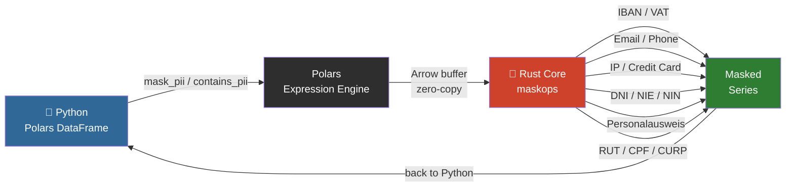

# MaskOps

> High-speed PII masking as a native Polars plugin — powered by Rust.

**MaskOps** extends Polars with zero-overhead PII detection and masking expressions.
No NLP models. No intermediate files. Just regex + Rust running directly on Arrow buffers.

## How It Works



No Python objects created per row. No NLP model loaded. No intermediate files.

- **Presidio** is heavy — it spins up NLP models for structured CSV data that doesn't need them.
- **Pure Python regex** on large DataFrames is slow.
- **MaskOps** compiles to a native `.so` that Polars calls directly — same speed as built-in expressions.

## Architecture

```
maskops/
├── Cargo.toml               # Rust dependencies
├── pyproject.toml           # maturin build backend + PyPI metadata
├── src/
│   ├── lib.rs               # Polars expression registration (mask_pii, contains_pii, mask_pii_fpe)
│   └── patterns/
│       ├── mod.rs           # mask_all(), mask_all_fpe(), contains_any_pii() aggregators
│       ├── iban.rs          # IBAN regex + masking
│       ├── vat.rs           # EU VAT regex + masking
│       ├── email.rs         # Email regex + masking (local part)
│       ├── phone.rs         # E.164 phone regex + masking + FPE
│       ├── ip.rs            # IPv4/IPv6 regex + masking
│       ├── latam_id.rs      # RUT (Chile), CPF (Brazil), CURP (Mexico) + FPE
│       ├── european_id.rs   # DNI/NIE (Spain), NIN (UK), Personalausweis (Germany)
│       ├── credit_card.rs   # Visa, Mastercard, Amex, Discover, Maestro + Luhn + FPE
│       ├── fpe.rs           # FF3-1 AES-256 format-preserving encryption (NIST SP 800-38G Rev.1)
│       └── country_codes.rs # Country prefix lookup table
├── maskops/
│   └── __init__.py          # Python API (mask_pii, contains_pii, mask_pii_fpe)
├── benchmarks/
│   └── benchmark.py         # Per-family throughput benchmarks (1M rows)
└── tests/
    ├── test_masking.py      # pytest suite (97 tests)
    ├── generate_fixtures.py # Faker-based test data generator (5 fixture files)
    └── fixtures/            # Generated CSVs (gitignored)
```

The Rust layer operates directly on Arrow buffers — zero Python object overhead per row.
Each PII type is its own module: adding a new pattern = new file + one line in `mod.rs`.

## Install

```bash
pip install maskops
```

## Usage

```python
import polars as pl
import maskops

df = pl.read_csv("payments.csv")

# Mask all PII in a column
df.with_columns(maskops.mask_pii("notes"))

# Filter rows that contain PII
df.filter(maskops.contains_pii("free_text"))
```

## Supported patterns (v0.1.4)

| Pattern | Example input | Masked output |
|---------|--------------|---------------|
| IBAN    | `DE89370400440532013000` | `DE89******************` |
| EU VAT  | `DE123456789` | `DE*********` |
| Email   | `john.doe@example.com` | `********@example.com` |
| Phone   | `+14155552671` | `+1**********` |
| IP Address | `192.168.1.100` | `192.168.*.*` |
| RUT (Chile) | `76.354.771-K` | `**********-K` |
| CPF (Brazil) | `529.982.247-25` | `*********-25` |
| CURP (Mexico) | `BADD110313HCMLNS09` | `******************` |
| DNI (Spain) | `12345678Z` | `********Z` |
| NIE (Spain) | `X1234567L` | `********L` |
| NIN (UK) | `AB 12 34 56 C` | `*********** C` |
| Personalausweis (Germany) | `T220001293` | `**********` |
| Credit Card (Visa/MC/Amex/Discover/Maestro) | `4111111111111111` | `411111******1111` |

Tested against 8 EU locales: DE, FR, ES, IT, NL, PL, PT, SE.
Email and phone follow RFC 5322 and E.164 respectively.
RUT and CPF include Módulo 11 check digit validation.
DNI and NIE include modulo 23 check letter validation.
Credit cards include Luhn validation — format-only matches are rejected.
Personalausweis and NIN: format-only matching; check digit validation pending (v0.2.0+).

## Roadmap

- [x] Email, phone patterns
- [x] IP address patterns
- [x] Latin American IDs (RUT, CPF, CURP)
- [x] European IDs (DNI/NIE Spain, NIN UK, Personalausweis Germany)
- [x] Credit cards (Visa, Mastercard, Amex, Discover, Maestro) with Luhn validation
- [x] PyPI publish via GitHub Actions
- [x] Check digit validation for Personalausweis (Germany) and NIN (UK)
- [ ] Format-Preserving Encryption (FPE/FF3-1) for reversible masking
- [ ] Benchmark improvement vs pure Python
- [ ] Benchmark vs Presidio
- [ ] Parquet streaming support

## Build from source

### Windows (PowerShell)

```powershell
python -m venv .venv
.venv\Scripts\activate
pip install maturin faker polars pytest
maturin develop --release
python tests/generate_fixtures.py
pytest tests/ -v
```

### Linux / macOS

```bash
python -m venv .venv
source .venv/bin/activate
pip install maturin faker polars pytest
maturin develop --release
python tests/generate_fixtures.py
pytest tests/ -v
```

## Key dependency versions

| Package | Version |
|---------|---------|
| pyo3 | 0.21 |
| pyo3-polars | 0.18 |
| polars | 0.46 |
| maturin | >=1.7,<2.0 |

> **Note:** pyo3 must be 0.21 to match pyo3-polars 0.18. Do not bump pyo3 independently.

## License

MIT

## Benchmarks

Tested on 1,000,000 rows, Intel i-series CPU, Python 3.14, Windows.

Median of 3 runs per benchmark.
Baseline uses equivalent regex coverage to maskops per family.

> **Note on per-family benchmarks:** maskops always runs the full pattern set —
> there is no per-family dispatch. A "Credit Card only" benchmark still pays for
> IBAN, VAT, email, phone, LatAm ID, and EU ID checks. The Python baseline only
> runs one regex. This is why maskops underperforms on isolated families with
> dense PII. The advantage emerges when all patterns are active simultaneously,
> which is the realistic production case.

### EU patterns (IBAN, VAT, Email, Phone)

| Profile | Expression | Time | Rows/s | Python re | Speedup |
|---------|-----------|------|--------|-----------|---------|
| clean | `mask_pii` | 2.455s | 407,300 | 4.268s | **1.7×** |
| clean | `contains_pii` | 1.184s | 844,846 | — | — |
| dense | `mask_pii` | 3.184s | 314,093 | 1.784s | 0.6× |
| dense | `contains_pii` | 0.133s | 7,497,325 | — | — |
| mixed | `mask_pii` | 2.943s | 339,774 | 1.993s | 0.7× |
| mixed | `contains_pii` | 0.282s | 3,551,833 | — | — |

### LatAm patterns (RUT, CPF, CURP)

| Profile | Expression | Time | Rows/s | Python re | Speedup |
|---------|-----------|------|--------|-----------|---------|
| clean | `mask_pii` | 2.276s | 439,367 | 2.319s | 1.0× |
| clean | `contains_pii` | 0.795s | 1,258,169 | — | — |
| dense | `mask_pii` | 3.048s | 328,080 | 1.690s | 0.6× |
| dense | `contains_pii` | 0.640s | 1,562,313 | — | — |
| mixed | `mask_pii` | 2.880s | 347,173 | 1.854s | 0.6× |
| mixed | `contains_pii` | 0.705s | 1,418,784 | — | — |

> RUT and CPF include Módulo 11 check digit validation per row — this is the cost of zero false positives.

### Network patterns (IP)

| Profile | Expression | Time | Rows/s | Python re | Speedup |
|---------|-----------|------|--------|-----------|---------|
| clean | `mask_pii` | 2.301s | 434,502 | 2.093s | 0.9× |
| clean | `contains_pii` | 0.799s | 1,251,735 | — | — |
| dense | `mask_pii` | 2.509s | 398,628 | 1.553s | 0.6× |
| dense | `contains_pii` | 0.215s | 4,655,272 | — | — |
| mixed | `mask_pii` | 2.504s | 399,408 | 1.684s | 0.7× |
| mixed | `contains_pii` | 0.374s | 2,671,550 | — | — |

### Credit card patterns (Visa, Mastercard, Amex, Discover, Maestro)

| Profile | Expression | Time | Rows/s | Python re | Speedup |
|---------|-----------|------|--------|-----------|---------|
| clean | `mask_pii` | 2.243s | 445,762 | 0.954s | 0.4× |
| clean | `contains_pii` | 0.792s | 1,261,873 | — | — |
| dense | `mask_pii` | 2.797s | 357,473 | 1.005s | 0.4× |
| dense | `contains_pii` | 0.628s | 1,591,805 | — | — |
| mixed | `mask_pii` | 2.687s | 372,166 | 1.014s | 0.4× |
| mixed | `contains_pii` | 0.674s | 1,484,572 | — | — |

> Luhn validation runs per candidate match — this eliminates false positives at the cost of single-family throughput.

### European ID patterns (DNI/NIE, NIN, Personalausweis)

| Profile | Expression | Time | Rows/s | Python re | Speedup |
|---------|-----------|------|--------|-----------|---------|
| clean | `mask_pii` | 2.282s | 438,149 | 1.410s | 0.6× |
| clean | `contains_pii` | 0.801s | 1,248,547 | — | — |
| dense | `mask_pii` | 2.609s | 383,334 | 1.107s | 0.4× |
| dense | `contains_pii` | 0.604s | 1,654,937 | — | — |
| mixed | `mask_pii` | 2.590s | 386,037 | 1.179s | 0.5× |
| mixed | `contains_pii` | 0.665s | 1,504,806 | — | — |

### All patterns active

> This is the realistic production workload — all 15 pattern types running simultaneously.
> maskops is up to **5.7× faster** than an equivalent pure Python approach.
> `contains_pii` reaches 1.9M rows/s on mixed data — use it to pre-filter before masking in hot pipelines.

| Profile | Expression | maskops | Python `re` | Speedup |
|---------|-----------|---------|-------------|---------|
| clean | `mask_pii` | 2.344s | 13.445s | **5.7×** |
| clean | `contains_pii` | 0.822s | — | — |
| dense | `mask_pii` | 3.269s | 6.625s | **2.0×** |
| dense | `contains_pii` | 0.520s | — | — |
| mixed | `mask_pii` | 3.285s | 6.581s | **2.0×** |
| mixed | `contains_pii` | 0.545s | — | — |

> maskops throughput stays roughly flat as pattern count grows — Python regex degrades with each additional pattern.
> The clean profile gap (5.7×) reflects Python's overhead of compiling and scanning a large combined regex on short-circuit misses.

### vs Microsoft Presidio (estimated)

Presidio processes structured DataFrames via `presidio-structured`, which runs a spaCy NLP pipeline per row. Based on community reports and the architecture:

| Tool | Throughput (structured data) | Requires NLP model |
|------|------------------------------|-------------------|
| maskops | ~305K–7.5M rows/s (measured) | No |
| Presidio (regex-only recognizers) | ~10–50K rows/s* | No |
| Presidio (spaCy NER) | ~1–5K rows/s* | Yes (250MB+) |

\* Estimated from community benchmarks and Presidio's own documentation noting it is "not optimized for bulk structured data." [Microsoft confirmed no official throughput benchmarks exist.](https://github.com/microsoft/presidio/discussions/1226)

**maskops is purpose-built for structured data pipelines where Presidio's NLP overhead is unnecessary.**

---

*This project was developed with AI assistance from [Claude](https://claude.ai) (Anthropic). All architecture decisions, security properties, and code were reviewed and validated by the author.*