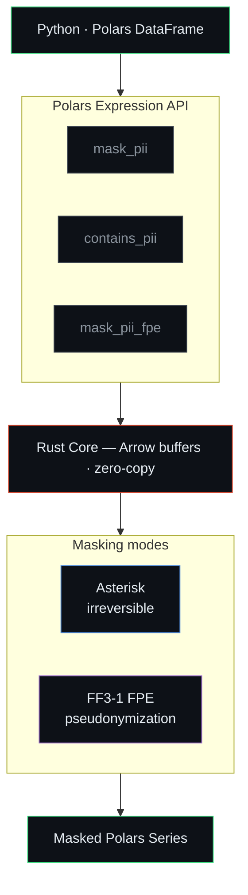

<p align="center">
  
</p>

<p align="center">
  <a href="https://github.com/fcarvajalbrown/MaskOps/actions/workflows/ci.yml"></a>
  <a href="https://pypi.org/project/maskops/"></a>
  <a href="https://pypi.org/project/maskops/"></a>
  <a href="LICENSE"></a>
  <a href="https://fcarvajalbrown.github.io/MaskOps/"></a>
</p>

> High-speed PII masking for Polars, powered by Rust. GDPR-compliant asterisk masking and FF3-1 format-preserving encryption for EU and Latin American PII.

**MaskOps** extends Polars with zero-overhead PII detection and masking expressions.
No NLP models. No intermediate files. Just regex + Rust running directly on Arrow buffers.

## Contents

- [Documentation](#documentation)
- [Install](#install)
- [Usage](#usage)
- [Supported patterns](#supported-patterns)
- [How It Works](#how-it-works)
- [Architecture](#architecture)
- [When to use MaskOps](#when-to-use-maskops)
- [Benchmarks](#benchmarks)
- [Build from source](#build-from-source)
- [Key dependency versions](#key-dependency-versions)
- [Roadmap](#roadmap)
- [License](#license)

## Documentation

Full docs, regulatory coverage, and pricing plans: **[fcarvajalbrown.github.io/MaskOps](https://fcarvajalbrown.github.io/MaskOps/)**

MaskOps is also listed in [awesome-polars](https://github.com/ddotta/awesome-polars#polars-plugins) under Security / Privacy.

## Install

```bash
pip install maskops
```

> **v1.0.0+ API stability guarantee** — no breaking changes to `mask_pii`, `contains_pii`, or `mask_pii_fpe` signatures without a major version bump.

## Usage

```python
import polars as pl
import maskops

df = pl.read_csv("payments.csv")

# Mask all PII in a column
df.with_columns(maskops.mask_pii("notes"))

# Filter rows that contain PII
df.filter(maskops.contains_pii("free_text"))
```

## Supported patterns

| Pattern | Example input | Masked output |
|---------|--------------|---------------|
| IBAN    | `DE89370400440532013000` | `DE89******************` |
| EU VAT  | `DE123456789` | `DE*********` |
| Email   | `john.doe@example.com` | `********@example.com` |
| Phone   | `+14155552671` | `+1**********` |
| IP Address | `192.168.1.100` | `192.168.*.*` |
| RUT (Chile) | `76.354.771-K` | `**********-K` |
| CPF (Brazil) | `529.982.247-25` | `*********-25` |
| CURP (Mexico) | `BADD110313HCMLNS09` | `******************` |
| DNI (Spain) | `12345678Z` | `********Z` |
| NIE (Spain) | `X1234567L` | `********L` |
| NIN (UK) | `AB 12 34 56 C` | `*********** C` |
| Personalausweis (Germany) | `T220001293` | `**********` |
| Credit Card (Visa/MC/Amex/Discover/Maestro) | `4111111111111111` | `411111******1111` |

Tested against 8 EU locales: DE, FR, ES, IT, NL, PL, PT, SE.
Email and phone follow RFC 5322 and E.164 respectively.
RUT and CPF include Módulo 11 check digit validation.
DNI and NIE include modulo 23 check letter validation.
Credit cards include Luhn validation — format-only matches are rejected.
Personalausweis: weighted-sum check digit (weights [7,3,1] cyclic, mod 10). NIN: HMRC-excluded prefix validation (BG, GB, KN, NK, NT, TN, ZZ rejected).

## How It Works



No Python objects created per row. No NLP model loaded. No intermediate files.

- **Presidio** is heavy: it spins up NLP models for structured CSV data that doesn't need them.
- **Pure Python regex** on large DataFrames is slow.
- **MaskOps** compiles to a native `.so` that Polars calls directly, at the same speed as built-in expressions.

## Architecture

```
maskops/
├── Cargo.toml               # Rust dependencies
├── pyproject.toml           # maturin build backend + PyPI metadata
├── src/
│   ├── lib.rs               # Polars expression registration (mask_pii, contains_pii, mask_pii_fpe)
│   └── patterns/
│       ├── mod.rs           # mask_all(), mask_all_fpe(), contains_any_pii() aggregators
│       ├── eu/
│       │   ├── iban.rs      # IBAN regex + masking
│       │   ├── vat.rs       # EU VAT regex + masking
│       │   └── european_id.rs # DNI/NIE (Spain), NIN (UK), Personalausweis (Germany)
│       ├── latam/
│       │   └── latam_id.rs  # RUT (Chile), CPF (Brazil), CURP (Mexico) + FPE
│       ├── contact/
│       │   ├── email.rs     # Email regex + masking (local part)
│       │   ├── phone.rs     # E.164 phone regex + masking + FPE
│       │   └── ip.rs        # IPv4/IPv6 regex + masking
│       ├── financial/
│       │   └── credit_card.rs # Visa, Mastercard, Amex, Discover, Maestro + Luhn + FPE
│       ├── fpe.rs           # FF3-1 AES-256 format-preserving encryption (NIST SP 800-38G Rev.1)
│       └── country_codes.rs # Country prefix lookup table
├── maskops/
│   └── __init__.py          # Python API (mask_pii, contains_pii, mask_pii_fpe)
├── benchmarks/
│   └── benchmark.py         # Per-family throughput benchmarks (1M rows)
└── tests/
    ├── test_masking.py      # pytest suite (246 tests)
    ├── generate_fixtures.py # Faker-based test data generator (5 fixture files)
    └── fixtures/            # Generated CSVs (gitignored)
```

The Rust layer operates directly on Arrow buffers — zero Python object overhead per row.
Each PII type is its own module: adding a new pattern = new file + one line in `mod.rs`.

## When to use MaskOps

| Situation | Recommended tool |
|-----------|-----------------|
| Structured data with schema-defined PII columns (CSV, Parquet, database exports) | **MaskOps** |
| Unstructured free text — need NER for names, places, organisations | Presidio |
| Both structured columns + free-text fields in the same pipeline | MaskOps + Presidio |
| Reversible pseudonymization required (GDPR Art. 4(5)) | **MaskOps** (`mask_pii_fpe`) |
| Air-gapped or offline environment | **MaskOps** — no network calls, ever |

`contains_pii` is useful as a pre-filter: scan cheaply first, then mask only flagged rows.

## Benchmarks

Tested on 1,000,000 rows, Intel i-series CPU, Python 3.14, Windows.

Median of 3 runs per benchmark. Each family is compared **like-for-like**: maskops
runs only that family's patterns (`mask_pii(..., patterns=[...])`), matching the exact
coverage of the Python `re` baseline. The three data profiles are `clean` (no PII),
`dense` (every row has PII), and `mixed` (50/50 — the realistic production case).

> **Why the clean profile is so fast:** every supported pattern requires at least one
> digit or an `@`, so maskops short-circuits any row without those bytes before running
> a single regex. Real-world text is mostly PII-free, so this dominates throughput.

### EU patterns (IBAN, VAT, Email, Phone)

| Profile | Expression | Time | Rows/s | Python re | Speedup |
|---------|-----------|------|--------|-----------|---------|
| clean | `mask_pii` | 0.102s | 9,791,624 | 3.224s | **31.6×** |
| clean | `contains_pii` | 0.028s | 35,608,478 | — | — |
| dense | `mask_pii` | 1.430s | 699,175 | 1.832s | **1.3×** |
| dense | `contains_pii` | 0.143s | 7,002,522 | — | — |
| mixed | `mask_pii` | 1.159s | 862,821 | 2.085s | **1.8×** |
| mixed | `contains_pii` | 0.119s | 8,419,309 | — | — |

### LatAm patterns (RUT, CPF, CURP)

| Profile | Expression | Time | Rows/s | Python re | Speedup |
|---------|-----------|------|--------|-----------|---------|
| clean | `mask_pii` | 0.083s | 11,995,024 | 2.364s | **28.4×** |
| clean | `contains_pii` | 0.022s | 44,911,928 | — | — |
| dense | `mask_pii` | 1.301s | 768,811 | 2.220s | **1.7×** |
| dense | `contains_pii` | 0.351s | 2,851,885 | — | — |
| mixed | `mask_pii` | 1.147s | 871,941 | 2.392s | **2.1×** |
| mixed | `contains_pii` | 0.329s | 3,039,982 | — | — |

> RUT and CPF include Módulo 11 check digit validation per row: that is the cost of zero false positives.

### Network patterns (IP)

| Profile | Expression | Time | Rows/s | Python re | Speedup |
|---------|-----------|------|--------|-----------|---------|
| clean | `mask_pii` | 0.101s | 9,895,621 | 2.777s | **27.5×** |
| clean | `contains_pii` | 0.029s | 34,285,322 | — | — |
| dense | `mask_pii` | 0.891s | 1,122,653 | 1.902s | **2.1×** |
| dense | `contains_pii` | 0.292s | 3,424,025 | — | — |
| mixed | `mask_pii` | 0.699s | 1,430,777 | 2.211s | **3.2×** |
| mixed | `contains_pii` | 0.228s | 4,384,771 | — | — |

### Credit card patterns (Visa, Mastercard, Amex, Discover, Maestro)

| Profile | Expression | Time | Rows/s | Python re | Speedup |
|---------|-----------|------|--------|-----------|---------|
| clean | `mask_pii` | 0.107s | 9,331,431 | 1.233s | **11.5×** |
| clean | `contains_pii` | 0.028s | 35,165,948 | — | — |
| dense | `mask_pii` | 1.061s | 942,647 | 1.337s | **1.3×** |
| dense | `contains_pii` | 0.345s | 2,902,612 | — | — |
| mixed | `mask_pii` | 0.819s | 1,220,878 | 1.371s | **1.7×** |
| mixed | `contains_pii` | 0.290s | 3,447,494 | — | — |

> Luhn validation runs per candidate match, which eliminates false positives.

### European ID patterns (DNI/NIE, NIN, Personalausweis)

| Profile | Expression | Time | Rows/s | Python re | Speedup |
|---------|-----------|------|--------|-----------|---------|
| clean | `mask_pii` | 0.100s | 9,996,062 | 1.748s | **17.5×** |
| clean | `contains_pii` | 0.026s | 37,979,203 | — | — |
| dense | `mask_pii` | 1.541s | 649,021 | 1.392s | 0.9× |
| dense | `contains_pii` | 0.370s | 2,703,177 | — | — |
| mixed | `mask_pii` | 1.248s | 800,992 | 1.472s | **1.2×** |
| mixed | `contains_pii` | 0.308s | 3,249,503 | — | — |

> The four EU-ID formats run as four separate regex passes; on 100%-dense data this is the one
> profile where a single combined Python regex edges ahead. Clean and mixed (realistic) still favour maskops.

### US patterns (SSN, Passport)

| Profile | Expression | Time | Rows/s | Python re | Speedup |
|---------|-----------|------|--------|-----------|---------|
| clean | `mask_pii` | 0.099s | 10,066,631 | 1.680s | **16.9×** |
| clean | `contains_pii` | 0.028s | 35,939,291 | — | — |
| dense | `mask_pii` | 0.972s | 1,028,341 | 1.570s | **1.6×** |
| dense | `contains_pii` | 0.447s | 2,238,417 | — | — |
| mixed | `mask_pii` | 0.739s | 1,352,974 | 1.628s | **2.2×** |
| mixed | `contains_pii` | 0.343s | 2,912,967 | — | — |

### All 15 benchmarked families active

> The realistic production workload — all 15 families the Python baseline implements, running
> together. maskops supports many more families; they are excluded here only to keep coverage
> equal on both sides. `contains_pii` reaches ~1M rows/s on dense data — use it to pre-filter
> before masking in hot pipelines.

| Profile | Expression | maskops | Python `re` | Speedup |
|---------|-----------|---------|-------------|---------|
| clean | `mask_pii` | 0.114s | 18.681s | **163.4×** |
| clean | `contains_pii` | 0.028s | — | — |
| dense | `mask_pii` | 4.693s | 12.659s | **2.7×** |
| dense | `contains_pii` | 0.959s | — | — |
| mixed | `mask_pii` | 5.239s | 10.620s | **2.0×** |
| mixed | `contains_pii` | 1.037s | — | — |

> maskops throughput stays roughly flat as pattern count grows, while Python regex degrades with each
> additional pattern. That is why the all-families gap (163× clean) dwarfs any single family.

### vs Microsoft Presidio (measured)

Benchmarked on 10,000 rows of mixed real-world text (email, phone, IBAN, credit cards, IP),
Python 3.11, Ubuntu, `en_core_web_lg` model. Extrapolated to 1M rows.

| Tool | Profile | Time (10K rows) | Rows/s | Speedup |
|------|---------|----------------|--------|---------|
| maskops | clean | 0.021s | 479,441 | — |
| Presidio (en_core_web_lg) | clean | 101.131s | 99 | **4,849× slower** |
| maskops | dense | 0.028s | 351,645 | — |
| Presidio (en_core_web_lg) | dense | 115.599s | 87 | **4,065× slower** |
| maskops | mixed | 0.028s | 358,118 | — |
| Presidio (en_core_web_lg) | mixed | 118.125s | 85 | **4,230× slower** |

> At Presidio's measured throughput of ~85–99 rows/s, processing 1M rows would take **2.8–3.3 hours**.
> maskops processes the same 1M rows in **under 3 seconds**.

#### Entity coverage

| Pattern | maskops | Presidio |
|---------|---------|---------|
| IBAN | ✓ | ✗ |
| EU VAT | ✓ | ✗ |
| Email | ✓ | ✓ |
| Phone (E.164) | ✓ | ✓ |
| IP Address | ✓ | ✓ |
| Credit Card | ✓ | ✓ |
| RUT (Chile) | ✓ | ✗ |
| CPF (Brazil) | ✓ | ✗ |
| CURP (Mexico) | ✓ | ✗ |
| DNI/NIE (Spain) | ✓ | ✗ |
| NIN (UK) | ✓ | ✗ |
| Personalausweis (Germany) | ✓ | ✗ |
| Person names (NER) | ✗ | ✓ |
| Locations (NER) | ✗ | ✓ |
| Organisations (NER) | ✗ | ✓ |

> Presidio's strength is unstructured text with named entities (names, locations, organisations). Reach for it when NER is required.
> maskops is purpose-built for structured data pipelines where schema-defined PII fields don't need NLP.
> For mixed workloads, both tools can be combined: maskops for bulk structured columns, Presidio for free-text fields.

**On structured data pipelines, maskops does the masking without carrying Presidio's NLP overhead.**

## Build from source

### Windows (PowerShell)

```powershell
python -m venv .venv
.venv\Scripts\activate
pip install maturin faker polars pytest
maturin develop --release
python tests/generate_fixtures.py
pytest tests/ -v
```

### Linux / macOS

```bash
python -m venv .venv
source .venv/bin/activate
pip install maturin faker polars pytest
maturin develop --release
python tests/generate_fixtures.py
pytest tests/ -v
```

## Key dependency versions

| Package | Version |
|---------|---------|
| pyo3 | 0.25 |
| pyo3-polars | 0.23 |
| polars | 0.46 |
| maturin | >=1.7,<2.0 |

> **Note:** pyo3 must be 0.25 to match pyo3-polars 0.23. Do not bump pyo3 independently.

## Roadmap

- [x] Email, phone patterns
- [x] IP address patterns
- [x] Latin American IDs (RUT, CPF, CURP)
- [x] European IDs (DNI/NIE Spain, NIN UK, Personalausweis Germany)
- [x] Credit cards (Visa, Mastercard, Amex, Discover, Maestro) with Luhn validation
- [x] PyPI publish via GitHub Actions
- [x] Check digit validation for Personalausweis (Germany) and NIN (UK)
- [x] Format-Preserving Encryption (FPE/FF3-1) for reversible masking
- [x] Benchmark vs Presidio
- [x] Parquet streaming support
- [x] `extract_pii` expression — returns a 31-field Struct column with the first match per PII family, enabling routing, reporting, and selective masking without re-scanning
- [x] `mask_pii_audit` expression — masks and reports per-family match counts in a single pass, returning a nested Struct (`masked` value + `counts`) for compliance auditing
- [x] Brazilian CNPJ (legal-entity) — two-check-digit validated detection and masking, in asterisk, FPE, and consistent modes
- [x] `masking_manifest` / `write_manifest` — per-column PII inventory with match counts, built-in family→regulation mapping, and mask mode, exported as a JSON RAT / data-processing register (Ley 21.719 Art. 30 evidence)
- [x] FF1 mode (NIST SP 800-38G) alongside FF3-1 — `mask_pii_fpe(..., mode="ff1")`, reversible and length-preserving
- [x] FPE key management — `derive_key` / `derive_tweak` (HKDF/HMAC, offline) and `validate_key` / `validate_tweak` weak-key guards
- [x] `rekey_pii_fpe` — FPE key rotation on a token column without exposing plaintext
- [x] MEA identifiers — South African ID (Luhn + DOB + citizenship, POPIA) and Israeli ID / Teudat Zehut (weighted checksum, PPL)
- [x] Unified `patterns=` selection across `extract_pii` and `mask_pii_audit` (v2.0 enterprise release) + migration guide
- [x] Performance sweep — byte pre-check short-circuit (skips all regex on PII-free rows), like-for-like benchmark methodology, and a full benchmark refresh: per-family speedups now 11–163× (clean) and 1.2–3.2× (mixed) vs the Python baseline
- [x] Type hints — PEP 561 `py.typed` marker and `.pyi` stubs for the full public API, so mypy and pyright type-check MaskOps out of the box

## License

[Mozilla Public License 2.0](LICENSE). Commercial use requires a separate license — see [CLA.md](CLA.md) or contact [fcarvajalbrown@gmail.com](mailto:fcarvajalbrown@gmail.com).
